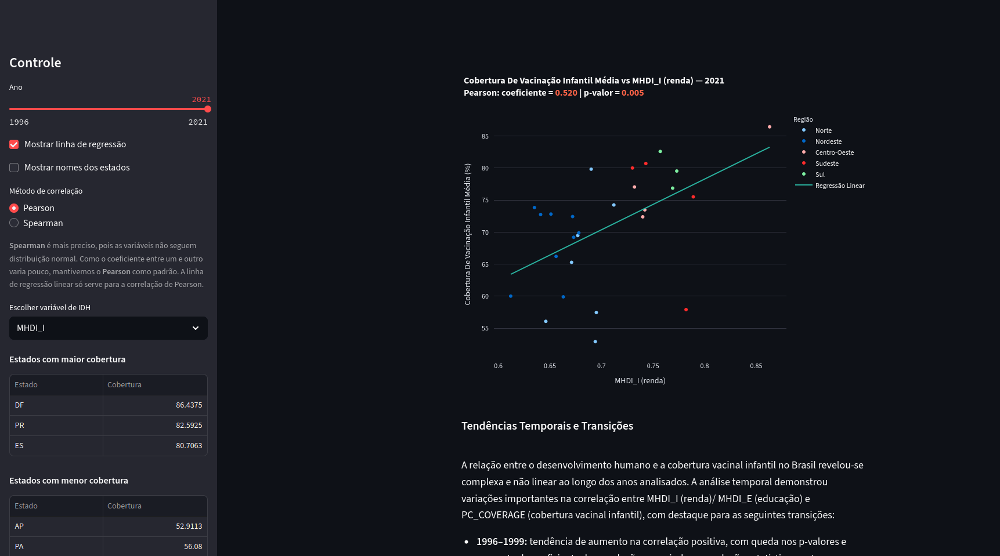

# Brazilian Vaccination Coverage vs. Human Development Index


### [🚀 View the Live Application Here](https://correlacao-vacinacao-infantil-mhdi.streamlit.app/)

---

This project is an interactive web application that analyzes the correlation between childhood vaccination coverage and the Human Development Index (HDI) across Brazilian states from 1996 to 2021.

The application is built with **Streamlit** and uses **Pandas** for data manipulation and **Plotly Express** for creating interactive visualizations.

## 🖼️ Application Preview

<p align="center">
  
</p>

---

## ✨ Features

* **Interactive Scatter Plot:** Visualize the relationship between vaccination coverage and HDI (income or education).
* **Time Series Analysis:** Use the slider to select a specific year to analyze, from 1996 to 2021.
* **Dynamic Correlation Calculation:** Choose between **Pearson** and **Spearman** correlation methods, with the coefficient and p-value updated in real-time.
* **Regression Line:** Toggle a linear regression line on the plot for Pearson correlations.
* **Regional Grouping:** States are color-coded by Brazilian region (Norte, Nordeste, Sul, Sudeste, Centro-Oeste).
* **Quick Insights:** The sidebar automatically displays the top 3 and bottom 3 states by vaccination coverage for the selected year.

---

## 🔬 Analysis & Key Findings

The application allows for the exploration of complex, non-linear trends between human development and vaccination rates over two decades. The key findings embedded in the app's analysis text show:

* **1996–1999:** A growing, statistically significant positive correlation between HDI and vaccination rates.
* **2006–2011:** A trend reversal towards a negative correlation, possibly influenced by public policies targeting lower-income regions.
* **2016–2021:** A return to a positive correlation in several years, potentially influenced by the socio-economic impacts of events like the COVID-19 pandemic.
* **Association vs. Causation:** The analysis highlights that while correlations are present, they do not prove causation. Robust statistical models would be needed to establish a cause-and-effect relationship.

---

## 🛠️ Technologies Used

* **Framework:** Streamlit
* **Data Analysis & Scientific Computing:** Pandas, NumPy, SciPy
* **Data Visualization:** Plotly Express
* **Language:** Python 3.11
* **Development Environment:** VS Code Dev Container

---

## ⚙️ How to Run the Project Locally

You can run this project using the included Dev Container (recommended) or by setting up a manual environment.

### Option 1: Using VS Code Dev Container (Recommended)

1.  **Prerequisites:** Docker Desktop, VS Code, and the Dev Containers extension.
2.  Clone this repository and open it in VS Code.
3.  Click the "Reopen in Container" prompt.
4.  VS Code will build the container, install dependencies, and start the Streamlit app automatically.

### Option 2: Manual Local Setup

1.  **Clone the repository:**
    ```bash
    git clone <your-repository-url>
    cd <repository-folder>
    ```

2.  **Create and activate a virtual environment:**
    ```bash
    # For Unix/macOS
    python3 -m venv .venv
    source .venv/bin/activate

    # For Windows
    python -m venv .venv
    .\.venv\Scripts\activate
    ```

3.  **Install the required dependencies:**
    ```bash
    pip install -r requirements.txt
    ```

4.  **Run the Streamlit application:**
    ```bash
    streamlit run app.py
    ```
5.  Open your web browser and navigate to the local URL provided (usually `http://localhost:8501`).

---
